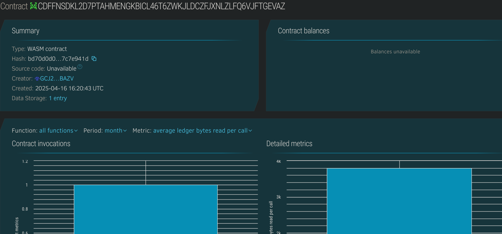

# Simple Token-Based Governance

## Project Description

This project implements a basic token-based governance system on the Stellar blockchain using Soroban smart contracts. Token holders can create proposals and vote based on the number of tokens they possess. The proposal with the most support can be executed (future enhancement), allowing decentralized decisions in a transparent and democratic manner.

## Project Vision

To build a foundational governance mechanism that enables decentralized organizations or communities to propose and vote on decisions proportionally to their token holdings.

## Key Features

- **Token Holder Management**: Add users with a specific number of governance tokens.
- **Proposal Creation**: Token holders can submit proposals with descriptions.
- **Voting System**: Token holders can vote for or against a proposal.
- **Vote Weighting**: Votes are weighted based on token holdings.
- **Proposal Query**: Retrieve all existing proposals.
- **Balance Check**: Users can check their token balances.

## Future Scope

- Add proposal execution logic (e.g., execute actions upon approval).
- Enable delegation of votes.
- Implement time-bound voting periods.
- Integrate with front-end dApps for ease of access.
- Token transfer and mint/burn capabilities.

## Contract Details
CDFFNSDKL2D7PTAHMENGKBICL46T6ZWKJLDCZFJXNLZLFQ6VJFTGEVAZ
